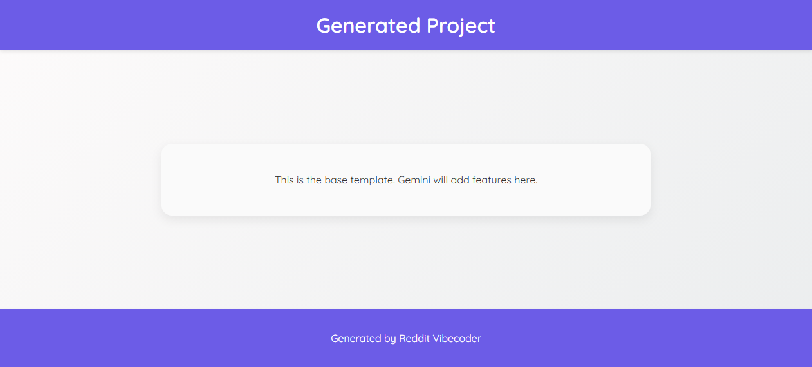

# A static web game called "Neighborhood Peeker" where players attempt to discreetly observe virtual neighbors in their hot tub to earn points, but must quickly hide to avoid getting caught and triggering a game over.

A static web game where the player attempts to earn points by 'peeking' at virtual neighbors in a hot tub. The player must quickly 'hide' to avoid being caught when the neighbor randomly looks up, or it's game over. The goal is to achieve the highest score.

## Features
- Simple game interface with background, player (hidden/peeking), and neighbor elements.
- Player controls (click/tap) to toggle between peeking and hiding states.
- Score accumulation while the player is in the 'peeking' state.
- Randomized 'neighbor looking up' events that serve as the detection mechanic.
- Game over condition if the player is peeking when the neighbor looks up.
- Display of current score.
- Game over screen with final score and a restart option.

## How to Run
- Open `index.html` in your browser

## Controls / Inputs
(This project may require keyboard/mouse input. Placeholder until auto-detected.)

## Preview

