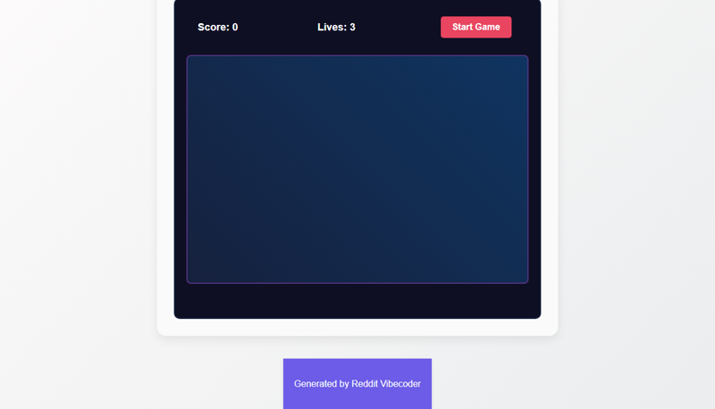

# Develop a simple static web app game where the player acts as an unobtrusive private security guard, clicking to subtly avert developing "trouble events" in a club scene before they escalate, without being noticed by the "students."

A static web app game where the player acts as a security guard, clicking on subtly appearing 'trouble events' within a club scene to avert them before they escalate. The goal is to prevent as many troubles as possible, scoring points, and avoiding 'game over' when too many events are missed.

## Features
- Dynamic game area representing a club scene.
- Random generation of clickable 'trouble events' at intervals.
- A timer for each trouble event; if not clicked in time, it escalates.
- Player click-to-avert mechanism for trouble events.
- Score tracking for successfully averted troubles.
- A 'lives' or 'escalation counter' for missed events.
- Game over condition when the escalation limit is reached.
- Restart functionality to play again.
- Basic visual feedback for successful clicks and escalations.

## How to Run
- Run with: `python main.py`

## Controls / Inputs
(This project may require keyboard/mouse input. Placeholder until auto-detected.)

## Preview

