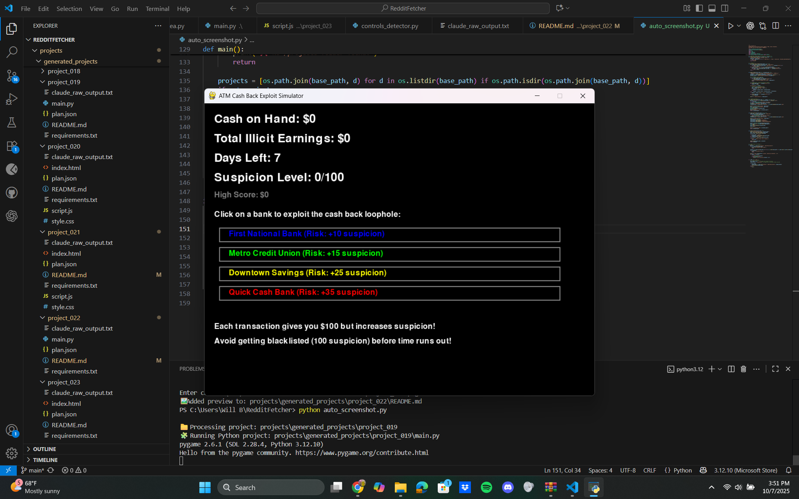

# Develop a simple text-based or static web game where players exploit a simulated 1980s ATM 'deposit with cash back' loophole across multiple banks to maximize their illicit earnings over a limited number of days before getting blacklisted.

A simple Pygame simulation where players exploit a simulated 1980s ATM 'deposit with cash back' loophole across multiple banks to maximize illicit earnings before getting blacklisted. The game is text-based with a graphical interface, focusing on quick replayability and strategic risk-taking.

## Features
- Display current cash on hand, total illicit earnings, remaining days, and current suspicion level.
- Interactive choice of 3-4 different banks, each with a distinct risk profile (chance of increasing suspicion significantly).
- Player performs a 'deposit with cash back' action at a chosen bank, receiving a fixed amount of cash.
- Each transaction increases suspicion and consumes one day.
- Game ends when suspicion reaches a critical threshold (blacklisted) or all days have passed.
- Final score (total illicit earnings) is displayed upon game over.
- Option to restart the game.

## How to Run
- Run with: `python main.py`

## Controls / Inputs
(This project may require keyboard/mouse input. Placeholder until auto-detected.)

## Preview

