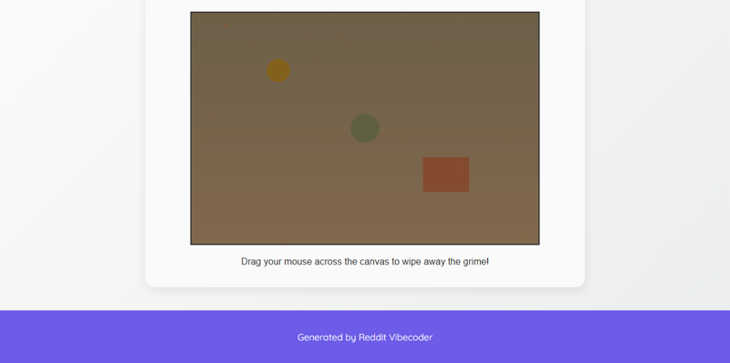

# A static web app where users can "wipe" away a layer of virtual grime on an HTML canvas by dragging their mouse, revealing a clean surface underneath, to simulate being busy.

A static web application simulating the act of being busy by allowing users to 'wipe' away a virtual layer of grime on an HTML canvas, revealing a clean surface underneath.

## Features
- HTML Canvas for interactive drawing.
- A hidden 'clean' background image or color.
- An initial 'grime' layer obscuring the background.
- Mouse drag interaction to 'wipe' away the grime, making it transparent.
- Real-time visual feedback of the wiping action.

## How to Run
- Open `index.html` in your browser

## Controls / Inputs
Here are the user input mechanisms used in this program:

*   **Mouse Clicks:** Pressing down and releasing a mouse button on the `grimeCanvas` element to initiate and cease wiping.
*   **Mouse Movement:** Dragging the mouse pointer across the `grimeCanvas` element while a mouse button is pressed to perform wiping.
*   **Touch Input:** Tapping and dragging a finger (or stylus) across the `grimeCanvas` element on touch-enabled devices to perform wiping.
*   **Mouse Leave:** Moving the mouse pointer out of the `grimeCanvas` area, which stops the wiping action.

## Preview

