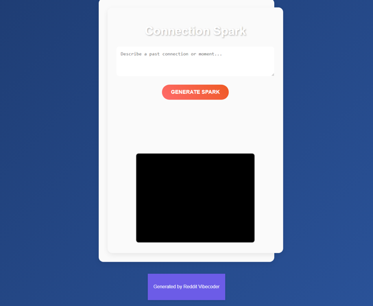

# A static web app where users input a description of a past connection, and clicking "Generate Spark" displays a randomized "what if" scenario accompanied by a simple, abstract visual animation representing that "electric" feeling.

A static web app where users input a description of a past connection. Upon clicking 'Generate Spark', the app displays a randomized 'what if' scenario text accompanied by a simple, abstract visual animation on a canvas, aiming to evoke an 'electric' or 'spark' feeling.

## Features
- User input text area for entering connection details.
- A button to trigger the 'Generate Spark' action.
- Display of a randomly selected 'what if' scenario.
- A simple, abstract visual animation on a canvas representing an 'electric spark' feeling.

## How to Run
- Open `index.html` in your browser

## Controls / Inputs
*   **Mouse click:** On the `generateButton` element.

## Preview

