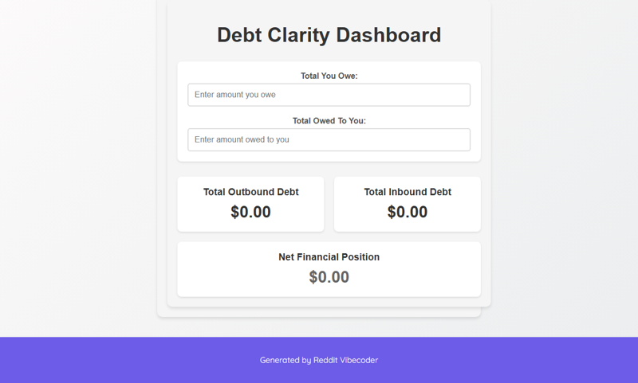

# Invent a simple "Debt Clarity Dashboard" web app where users input their total outstanding loans and the total money owed to them by others, and it instantly displays a net financial position and a summary of inbound vs. outbound debt.

A simple client-side web application where users input their total outstanding loans (outbound debt) and the total money owed to them by others (inbound debt). It instantly calculates and displays their net financial position and a clear summary of inbound versus outbound debt.

## Features
- Input field for total money owed by the user (outstanding loans).
- Input field for total money owed to the user by others.
- Real-time calculation of net financial position.
- Display of total outbound debt (money user owes).
- Display of total inbound debt (money owed to user).
- Clear visual representation of results, including positive/negative net position.

## How to Run
- Open `index.html` in your browser

## Controls / Inputs
*   **Input field:** User types a numerical value into the 'owedByMe' input field.
*   **Input field:** User types a numerical value into the 'owedToMe' input field.

## Preview

