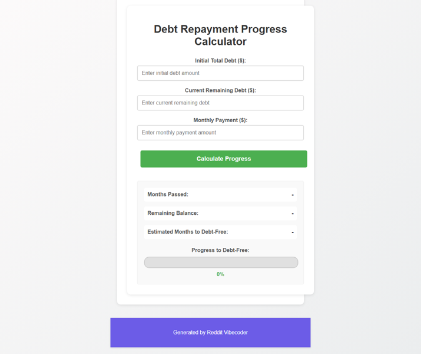

# A static web app that allows a user to input their total debt and monthly payment, then visually tracks their remaining balance and months passed with a progress bar until they are debt-free.

A static web application that calculates and visualizes a user's debt repayment progress from an initial amount to their current remaining balance, displaying months passed, remaining balance, and a progress bar to illustrate the journey to being debt-free.

## Source Reddit Post
[View original post](https://reddit.com/r/confession/comments/1o1eu3j/i_really_dont_know_how_will_we_get_out_of_this/)

## Features
- Input fields for initial total debt, current remaining debt, and monthly payment.
- Calculation of months passed and total estimated months to debt-free.
- Display of current remaining balance and calculated months passed.
- A visual progress bar indicating the percentage of initial debt paid off.
- Basic input validation for positive numbers and logical debt progression.

## How to Run
- Run with: `python main.py`

## Controls / Inputs
Here are the user input mechanisms used in this program:

*   **Input field:** For entering the 'initial-debt' (requires keyboard input for numerical values).
*   **Input field:** For entering the 'current-debt' (requires keyboard input for numerical values).
*   **Input field:** For entering the 'monthly-payment' (requires keyboard input for numerical values).
*   **Button:** With the ID 'calculate-btn'.
*   **Mouse click:** On the 'calculate-btn'.

## Preview

