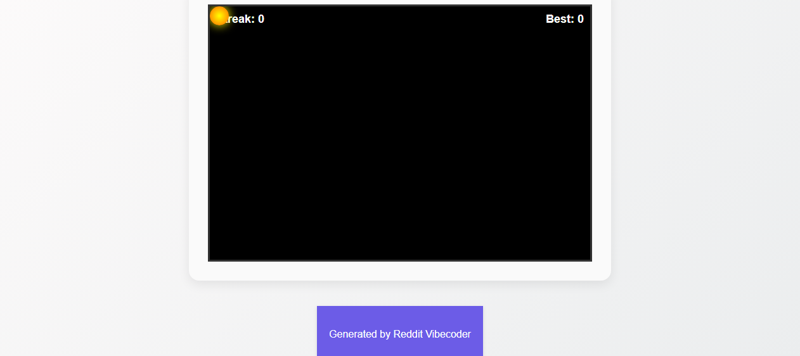

# An HTML/CSS/JS game where players click to 'catch' a moving 'spark' at a precise moment to keep an electric connection alive, aiming for the longest streak before the spark fades.

A web-based arcade game where players click a moving 'spark' element at the precise moment to maintain an electric connection and build the longest streak, before the spark fades or they click outside it.

## Source Reddit Post
[View original post](https://reddit.com/r/confession/comments/1o1gf49/theres_this_one_woman_i_still_think_about_years/)

## Features
- Interactive game area with a dynamically moving 'spark' element.
- Click detection on the 'spark' for scoring and interaction.
- Real-time display of the player's current successful click streak.
- Persistent high score tracking, saved and loaded using browser's local storage.
- Dynamic difficulty scaling: the spark's movement speed increases and its on-screen duration ('fade time') decreases as the streak progresses.
- Clear loss conditions: the game ends if the player clicks anywhere other than the 'spark', or if the 'spark' fades before being successfully clicked.
- A clean game over screen displaying final score and a 'Restart Game' option.
- Procedural gameplay design ensuring endless replayability and skill-based progression.

## How to Run
- Run with: `python main.py`

## Controls / Inputs
Here are the user input mechanisms used in this program:

*   **Mouse click:** On the `spark` element (to increase streak and reset spark timer).
*   **Mouse click:** On the `gameArea` element (to trigger game over if the spark is not clicked).
*   **Mouse click:** On the `restartButton` (to start a new game).

## Preview

