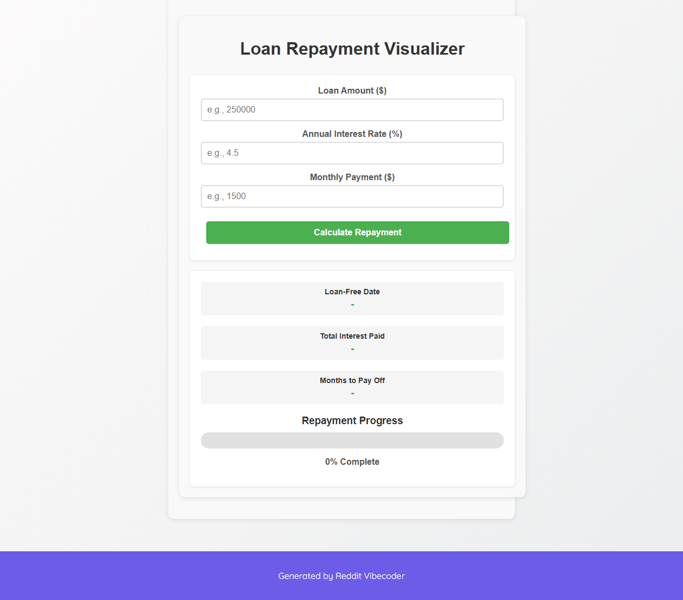

# Create a static web app (HTML/CSS/JS) where users input a loan amount, interest rate, and monthly payment to visualize their debt repayment progress with a dynamic bar and estimated 'loan-free' date.

A static web application for visualizing loan repayment progress. Users input loan amount, annual interest rate, and monthly payment to see a dynamic progress bar of debt reduction and an estimated 'loan-free' date, along with total interest paid.

## Source Reddit Post
[View original post](https://reddit.com/r/confession/comments/1o1eu3j/i_really_dont_know_how_will_we_get_out_of_this/)

## Features
- User input fields for loan amount, annual interest rate, and monthly payment.
- Calculates and displays the estimated 'loan-free' date.
- Calculates and displays the total interest paid over the life of the loan.
- Visualizes debt repayment progress with a dynamic bar (e.g., representing percentage of loan paid off).
- Basic input validation to ensure positive numbers and a sufficient monthly payment.

## How to Run
- Run with: `python main.py`

## Controls / Inputs
Here are the user input mechanisms used in this program:

*   **Typing into the "loan amount" input field**: Users can enter numerical values.
*   **Typing into the "interest rate" input field**: Users can enter numerical values.
*   **Typing into the "monthly payment" input field**: Users can enter numerical values.
*   **Pressing the "Enter" key**: While focused on the "loan amount", "interest rate", or "monthly payment" input fields, pressing Enter triggers the calculation.
*   **Clicking the "Calculate" button**: Initiates the loan repayment calculation.

## Preview

