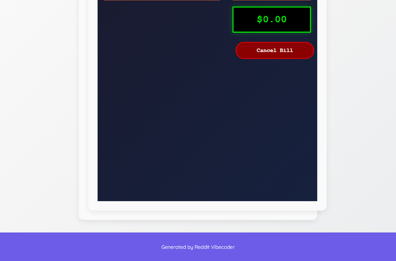

# Develop a static web application that simulates an early 2000s cable TV premium channel menu, where clicking "watch" on various "Skinemax" style movie titles dynamically updates and displays a growing "monthly bill" on the page, with an option to "cancel" the bill.

A static web application simulating an early 2000s premium cable TV channel menu. Users can 'watch' various 'Skinemax' style movies, which dynamically adds charges to a visible monthly bill. An option to 'cancel' the bill is also provided.

## Source Reddit Post
[View original post](https://reddit.com/r/confession/comments/1o1g3fg/racked_up_a_huge_cable_bill_for_my_parents_with/)

## Features
- Static HTML structure for a retro TV menu interface.
- Display of several 'Skinemax' style movie titles with 'Watch' buttons.
- Dynamic 'Monthly Bill' display, initially $0.00.
- Clicking a 'Watch' button adds a predefined cost to the 'Monthly Bill'.
- The bill accumulates with each movie 'watched'.
- A 'Cancel Bill' button to reset the monthly bill to $0.00.
- Basic styling to evoke an early 2000s cable TV aesthetic.

## How to Run
- Run with: `python main.py`

## Controls / Inputs
Here are the user input mechanisms used in this program:

*   Mouse click on "Watch" buttons (to add movies to the bill)
*   Mouse click on the "Cancel Bill" button (to reset the bill)

## Preview

