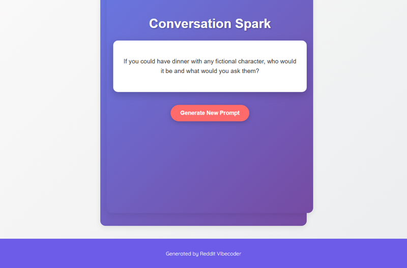

# A static web app that generates quirky, thought-provoking conversation starters or "out-of-the-box" challenges with the click of a button.

A static web application that generates unique, thought-provoking conversation starters or 'out-of-the-box' challenges with the click of a button, displayed directly in the browser.

## Source Reddit Post
[View original post](https://reddit.com/r/confession/comments/1o1g8dh/i_do_weird_things_and_say_cringe_stuff_because_im/)

## Features
- Displays a random quirky conversation starter/challenge.
- A button to generate and display a new prompt.
- Clean and responsive user interface.

## How to Run
- Open `index.html` in your browser

## Preview

