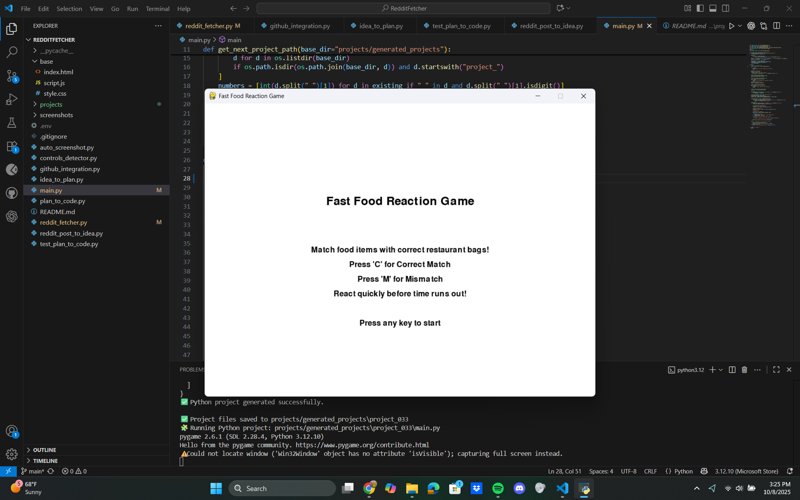

# A simple game where players are presented with a fast-food item and a restaurant bag, and must quickly identify if the combination is correct or a "wrong bag" mismatch before time runs out.

A fast-paced reaction game where players are presented with a fast-food item and a restaurant bag, and must quickly identify if the combination is correct or a 'wrong bag' mismatch before a timer runs out.

## Source Reddit Post
[View original post](https://reddit.com/r/mildlyinteresting/comments/1o19yp1/i_ordered_taco_bell_on_doordash_and_it_came_to_me/)

## Features
- Display a random fast-food item image.
- Display a random restaurant bag image.
- Player input (keyboard) to choose 'Correct Match' or 'Wrong Bag Mismatch'.
- Per-round timer for player reaction speed.
- Real-time current score display.
- Persistent high score display (within the session).
- Difficulty scaling: reaction time decreases with score progression.
- Game-over condition: running out of time or making an incorrect choice.
- Clean game restart functionality after game over.

## How to Run
- Run with: `python main.py`

## Preview

