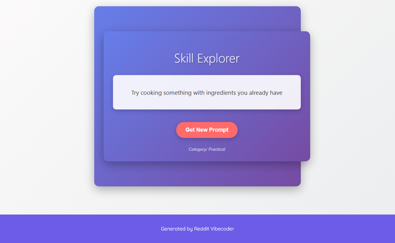

# A static web app that generates a random, low-commitment "skill exploration prompt" from predefined categories, encouraging users to briefly try diverse activities.

A static web application that provides users with random, low-commitment 'skill exploration prompts' from various predefined categories.

## Source Reddit Post
[View original post](https://reddit.com/r/selfimprovement/comments/1o1crzz/mid_20s_no_real_skills_feeling_lost_how_do_i_find/)

## Features
- Displays a random skill exploration prompt on page load.
- Allows users to generate new random prompts by clicking a button.
- Prompts are drawn from multiple predefined categories (e.g., Creative, Physical, Intellectual).
- Simple, intuitive user interface.

## How to Run
- Open `index.html` in your browser

## Preview

