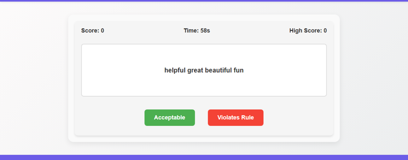

# A simple web-based game where players act as moderators, quickly categorizing incoming text snippets as 'Acceptable' or 'Violates Rule' based on predefined keywords to achieve the highest score before a timer expires.

A simple browser-based game where players quickly classify generated text snippets as 'Acceptable' or 'Violates Rule' based on embedded keywords. The goal is to achieve the highest score before a timer expires, with difficulty increasing as the game progresses.

## Source Reddit Post
[View original post](https://reddit.com/r/DecidingToBeBetter/comments/1h9xwd1/addressing_community_concerns_no_pornmasturbation/)

## Features
- Display of incoming random text snippets.
- Interactive buttons for 'Acceptable' and 'Violates Rule' classification.
- Real-time scoring: +1 for correct, -1 for incorrect classification.
- Countdown game timer.
- Dynamic difficulty: increased probability of rule-violating snippets as score rises.
- Display of current score and a persistent high score (using browser's localStorage).
- Clear game over state with final score, high score, and a restart option.

## How to Run
- Open `index.html` in your browser

## Preview

