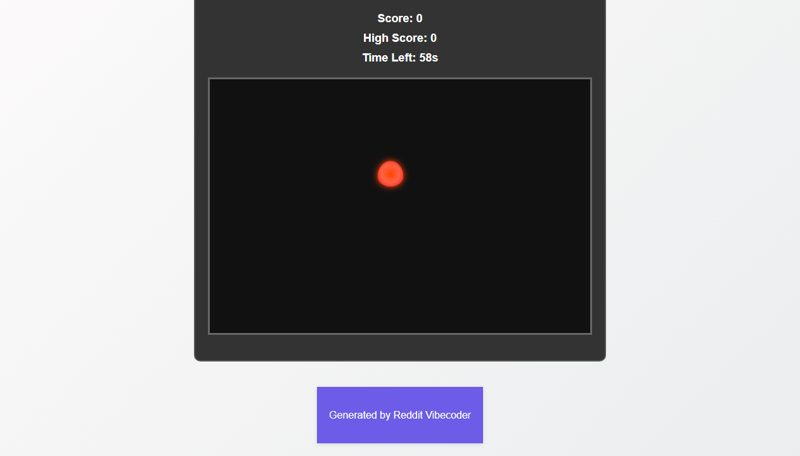

# Create a simple web-based "Firefighter Frenzy" game where players must rapidly click on small, randomly appearing cartoon fires to extinguish them with a water-themed cursor before they spread or a timer runs out.

A simple web-based arcade game where players rapidly click on randomly appearing cartoon fires to extinguish them before a timer runs out, aiming for a high score.

## Source Reddit Post
[View original post](https://reddit.com/r/explainlikeimfive/comments/1o1ijvd/eli5_why_is_water_so_good_at_putting_out_fires/)

## Features
- Interactive game area where fires appear.
- Fires (visual elements) spawn at random locations.
- Clicking a fire extinguishes it, awarding points.
- Custom water-themed cursor for gameplay.
- Real-time display of current score and a persistent high score.
- Time-based game loss condition.
- Difficulty scaling: fire spawn rate increases as score progresses.
- Game over screen with an option to restart the game.

## How to Run
- Open `index.html` in your browser

## Preview

