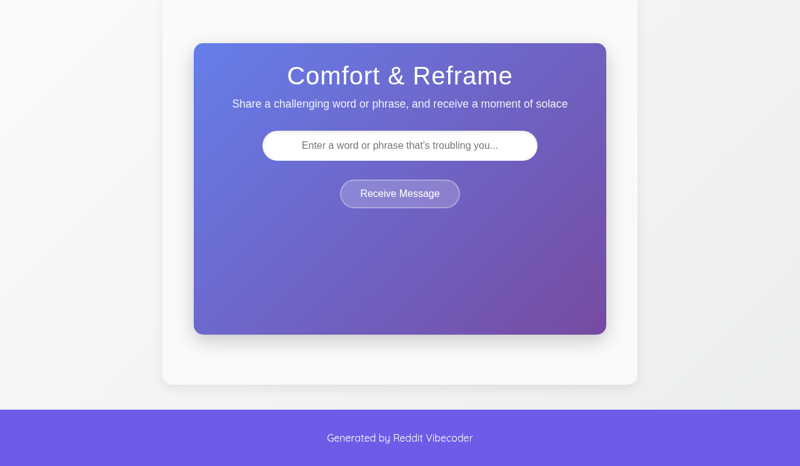

# A static web app where users input a difficult last word or phrase and receive a randomized, comforting, and reframing message.

A static web application where users can input a challenging word or phrase and, upon submission, receive a randomly selected comforting and reframing message from a predefined list, aiming to provide a moment of reflection and solace.

## Source Reddit Post
[View original post](https://reddit.com/r/TrueOffMyChest/comments/1o27vx3/my_grandma_died_today_her_last_words_to_me_were/)

## Features
- User input field for a word or phrase
- A 'Receive Message' button
- Display area for the generated comforting message
- Random selection of a message from an internal list
- Clean, user-friendly interface

## How to Run
- Open `index.html` in your browser

## Preview

