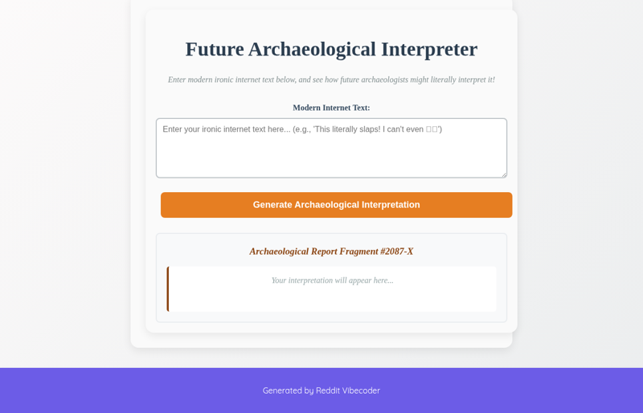

# A static web app where users input modern ironic internet text, and the app generates a "future archaeological interpretation" that takes the content literally, demonstrating how irony might be misinterpreted by future historians.

A static web application where users input modern ironic internet text, and the app generates a 'future archaeological interpretation' of the content, highlighting how literal translation might misrepresent original intent.

## Source Reddit Post
[View original post](https://reddit.com/r/Futurology/comments/1o1z9b4/sometines_i_think_about_if_future_archeologists/)

## Features
- Textarea for user input of ironic internet text.
- Button to trigger the interpretation generation.
- Display area for the generated 'future archaeological interpretation'.
- Client-side processing (no server required).

## How to Run
- Open `index.html` in your browser

## Preview

