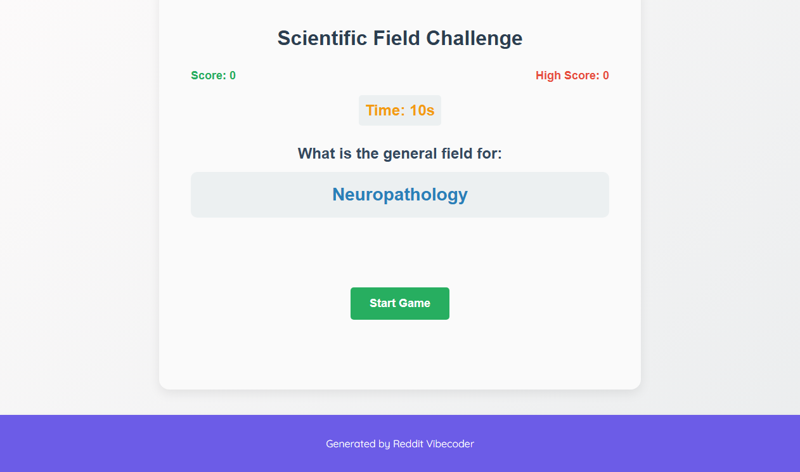

# A static web app game presents users with specific scientific research areas or specific fields (e.g., 'Neuropathology', 'Quantum Chemistry') and challenges them to select the correct broad 'General Field' (like Biology, Physics, or Social Sciences) from a predefined list, tracking their score before a game-over.

A static web app game challenging users to quickly identify the broad 'General Field' for specific scientific research areas within a time limit, tracking scores and a persistent high score.

## Source Reddit Post
[View original post](https://reddit.com/r/askscience/comments/1ne8kjj/askscience_panel_of_scientists_xxviii/)

## Features
- Display a specific scientific research area (e.g., 'Neuropathology').
- Present multiple choice buttons for broad 'General Fields' (e.g., Biology, Physics, Social Sciences).
- Implement a countdown timer for each question.
- Track and display the current score.
- Track and display a persistent high score (using browser's local storage).
- Increase game difficulty by progressively decreasing the time limit per question.
- Game-over condition upon incorrect selection or timer running out.
- Clean game restart functionality after game-over.

## How to Run
- Open `index.html` in your browser

## Preview

