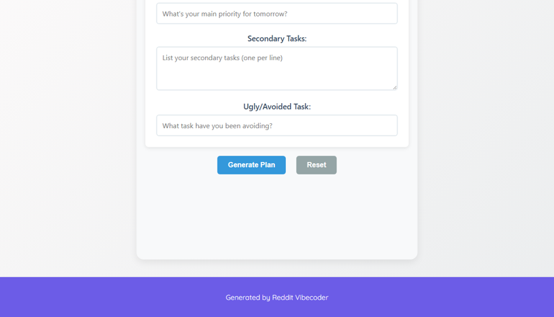

# A static web application (HTML/CSS/JS) where users quickly input tomorrow's main focus, secondary tasks, and one "ugly" or avoided task, which then instantly generates a concise, structured daily plan to eliminate decision fatigue.

A static web application for users to quickly input tomorrow's main focus, secondary tasks, and one avoided task, which then instantly generates a concise, structured daily plan displayed directly in the browser.

## Source Reddit Post
[View original post](https://reddit.com/r/selfimprovement/comments/1o2eakv/productivity_advice_from_someone_old_enough_to_be/)

## Features
- Dedicated input fields for Main Focus, Secondary Tasks (multiline), and Ugly/Avoided Task.
- A 'Generate Plan' button to process inputs and display the structured plan.
- A 'Reset' button to clear all input fields and the displayed plan.
- Dynamic generation and display of a prioritized daily plan.
- Basic, clean styling for improved user experience.

## How to Run
- Open `index.html` in your browser

## Preview

