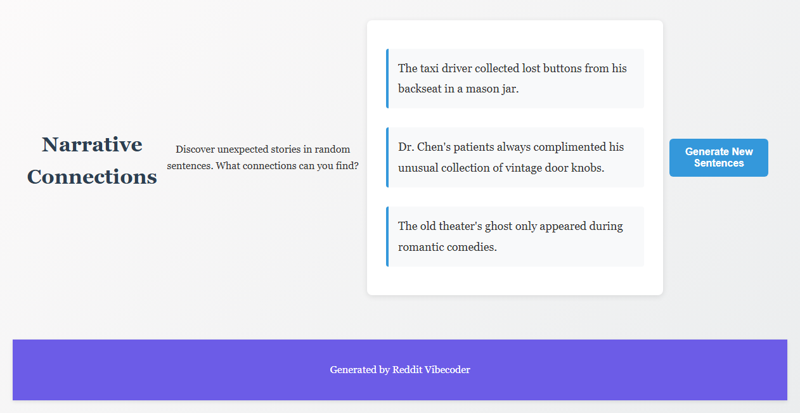

# A static web app that displays 2-3 randomly selected, unrelated sentences from a curated list, prompting users to discover an emergent 'theme' or 'story' that the 'author' (the program) never intended.

A static web application presenting 2-3 randomly chosen, disparate sentences from a predefined list, encouraging users to creatively identify an emergent, unintended narrative or thematic connection.

## Source Reddit Post
[View original post](https://reddit.com/r/unpopularopinion/comments/1o2ae6t/a_storys_depth_isnt_always_the_result_of_careful/)

## Features
- Curated internal corpus of diverse sentences.
- Logic to randomly select 2-3 unique sentences from the corpus.
- Dynamic display of the selected sentences on the web page.
- A button to regenerate and display a new set of random sentences.
- Basic styling for a clear and readable user interface.

## How to Run
- Open `index.html` in your browser

## Preview

