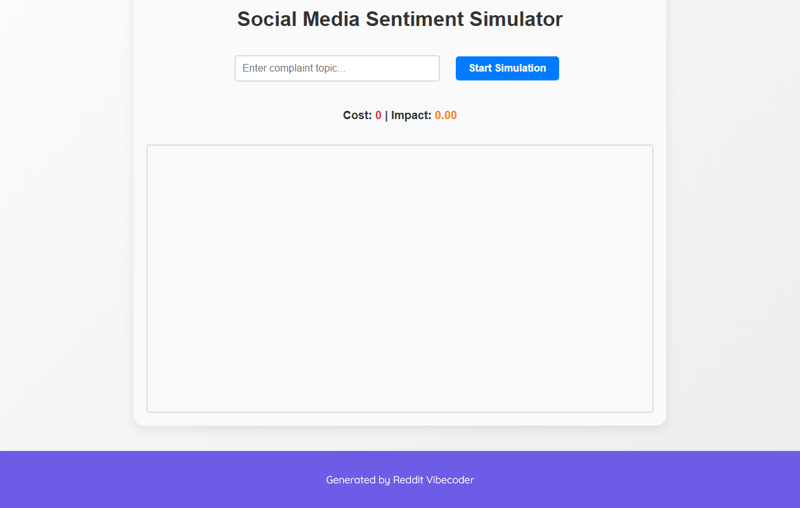

# A static HTML/CSS/JS web application where users input a complaint topic and the app dynamically generates and displays a simulated stream of varied social media posts from different "bot" profiles, tracking a virtual "cost" and "impact" meter.

A static HTML/CSS/JS web application that simulates a real-time social media stream based on a user-defined complaint topic. The app generates posts from various 'bot' profiles, each post contributing to virtual 'cost' and 'impact' meters, providing a dynamic visualization of public sentiment and its simulated effects.

## Source Reddit Post
[View original post](https://reddit.com/r/ProRevenge/comments/1n6k4ph/lock_my_funds_because_of_your_mistake_have_your/)

## Features
- User input field for a custom complaint topic.
- Dynamic generation of social media posts at regular intervals.
- Multiple 'bot' profiles with distinct names/personas.
- Posts incorporate the user's topic and varied sentiments.
- Virtual 'Cost' meter that incrementally increases with each post.
- Virtual 'Impact' meter that incrementally increases with each post.
- A scrollable display area for the simulated social media feed.
- Basic, clean user interface (HTML/CSS).

## How to Run
- Open `index.html` in your browser

## Preview

