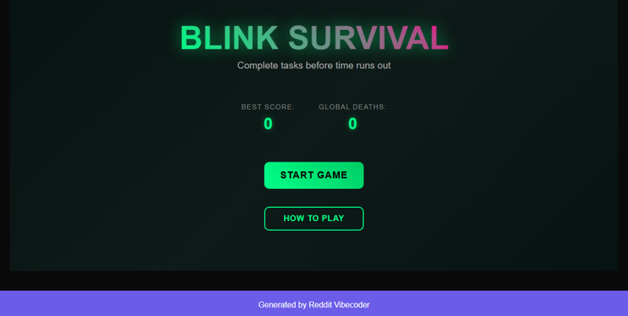

# A replayable arcade game where the player must rapidly complete a target-clicking or key-pressing task within a very short 'blink interval' to survive each round, with the game ending upon failure and the final score displaying the number of 'blink intervals' survived and the cumulative global deaths implied.

A fast-paced, replayable arcade game where players must rapidly complete a target-clicking or key-pressing task within a 'blink interval' to survive. The game progressively increases in difficulty, tracks personal high scores, and contributes to a persistent global death counter upon failure, all presented with an impressive, polished web interface.

## Source Reddit Post
[View original post](https://reddit.com/r/Showerthoughts/comments/1ohg077/on_average_6_to_8_people_die_between_your_blinks/)

## Features
- Core 'Blink Interval' Survival Mechanic: Player must complete a task within a short, dynamically decreasing time limit.
- Dynamic Difficulty Scaling: Blink interval duration decreases, number of active tasks increases, and task complexity varies with each survived round.
- Multiple Task Types: Features point-and-click target tasks, specific key-press tasks, and sequential key-press tasks.
- Current Score & Best Score Tracking: Displays rounds survived in current game and persistently stores the player's highest rounds survived using localStorage.
- Persistent Cumulative Global Deaths: Increments a 'global deaths' counter stored in localStorage each time a game ends, displayed prominently on start/game over screens.
- Game Over & Clean Restart: Clear game over screen displaying final stats (current score, high score, global deaths) with a smooth transition to restart.
- On-screen Countdown Timer/Progress Bar: A clear visual indicator showing the remaining time within the 'blink interval', with critical state warnings.
- Visual Feedback for Actions: Immediate and distinct visual cues (e.g., glows, fades, 'Miss!' text) for successful task completions and failures.
- Dynamic Theming/Background: Visual changes in color scheme, intensity, or subtle animations to reflect increasing difficulty and game state.
- Start Screen & Tutorial Overlay: Welcoming screen with prominent 'Start Game' button, current high score, global deaths, and an accessible 'How to Play' tutorial modal.
- Pause/Resume Functionality: Allows players to temporarily halt the game and resume seamlessly.
- Responsive Layout: Ensures the game UI elements adapt gracefully within a predefined container for various desktop browser window sizes.

## Visual Polish
- Particle Effects: On successful target clicks, correct key presses, and a different effect for task failures.
- Screen Shake: Subtle screen shake effect on critical failures, near-misses, or when reaching new difficulty tiers.
- Smooth UI Transitions: Graceful fade-ins/outs and slide animations for changing game states (Start, Playing, Paused, Game Over) and UI element updates.
- Dynamic Color Palette: The game's background and core UI elements subtly shift their color scheme as difficulty escalates, or on significant game events.
- Animated Score & Feedback Pop-ups: Scores (`+1`, `+N`) float up from completed tasks, and messages like 'FAIL!' or 'Perfect!' animate prominently on relevant events.

## How to Run
- Open `index.html` in your browser

## Preview

