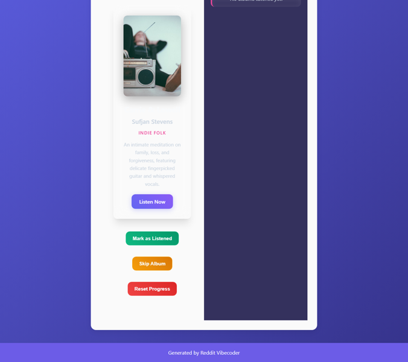

# A static web app that presents one recommended "lesser known" album at a time from a curated list, allowing users to mark it as completed after listening start-to-finish and then reveal a new recommendation, with progress saved locally.

A static web application that serves as a personal music discovery companion, presenting users with a single, curated 'lesser known' album recommendation. Users can delve into album details, mark an album as completed after a full listen, and unlock new suggestions. The app tracks listening progress and maintains a history of completed albums, all saved locally to provide a persistent, personalized experience.

## Source Reddit Post
[View original post](https://reddit.com/r/AskMen/comments/1oj8ued/40_year_old_men_what_lesser_known_album_should/)

## Features
- Dynamic Album Display: Presents a single album with cover art, title, artist, genre, and a brief description.
- Listen Link: Provides a clickable link (e.g., Spotify/YouTube) to stream the recommended album externally.
- "Mark as Listened" Action: Allows users to mark the current album as completed, triggering the display of a new recommendation.
- Progress Tracking: Displays the total number of albums listened to by the user as a persistent counter.
- Local Storage Persistence: Saves listening progress, completed album IDs, and the current recommendation state across browser sessions.
- Curated Album Pool: Manages a predefined, internal list of 'lesser known' albums to be recommended.
- Smart Recommendation Logic: Selects a new, unlistened album from the pool, ensuring all unique albums are presented before cycling through listened ones.
- "Skip Album" Functionality: Allows users to skip the current recommendation without marking it as listened, making it reappear later if no other unlistened albums exist.
- Listened History Display: Shows a scrollable sidebar with a chronological list of all albums previously marked as listened, including their basic details.
- "Reset Progress" Option: Provides a clear button to wipe all local listening data and reset the app to its initial state.
- Responsive UI (Container-based): Ensures the application layout adjusts gracefully within its parent container for various screen sizes.
- Informative Empty States: Displays clear messages for situations like 'No albums listened yet' or 'All albums listened through'.

## Visual Polish
- Album Card Transition: When an album is marked as listened or skipped, the main album card performs a smooth, engaging slide or 3D flip transition to reveal the next recommendation.
- Interactive Button Hover & Click Effects: All interactive buttons feature subtle scale-up or color-shift animations on hover, coupled with a satisfying 'press' feedback on click.
- Dynamic Background Gradient: A subtle, slowly animating background gradient or ambient visual effect that gently shifts colors or intensity, creating an immersive mood.
- "Listened" Streak Animation: A small, celebratory particle burst or counter animation appears when an album is marked as listened, visually confirming the progress update.
- Custom Scrollbar & Entry Fade-in: The history sidebar features a custom-styled, sleek scrollbar, and new history entries subtly fade-in with a short delay when added.

## How to Run
- Open `index.html` in your browser

## Preview

