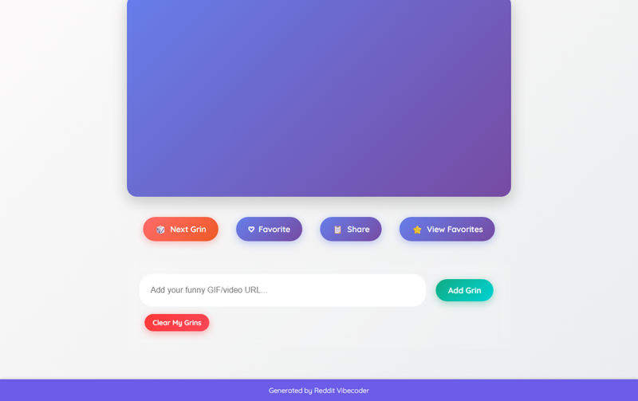

# Create a static web app that, upon loading or button click, displays a random, short, funny video or GIF from a curated collection to offer users a quick, unexpected moment of genuine amusement.

A static web app that delivers a quick, random dose of humor through a curated collection of funny videos and GIFs, designed to bring an instant smile and a moment of genuine amusement.

## Source Reddit Post
[View original post](https://reddit.com/r/CasualConversation/comments/1oj3bfw/didnt_realize_how_emotionally_drained_i_was_until/)

## Features
- Random Content Display: Automatically shows a new funny GIF or short video on page load.
- Explicit 'Next Grin' Button: Allows users to manually request another random piece of content.
- Curated & Dynamic Collection: Starts with a pre-defined set of amusing GIFs/videos, dynamically handling both image and video formats.
- Loading State Feedback: Displays a custom, themed loading animation while new content is being fetched/prepared.
- "Favorite" Content Toggle: Users can mark content as a favorite, persisting their choices using localStorage.
- Favorites Gallery: A dedicated modal or section to view all favorited content, with options to re-display or remove from favorites.
- Content Sharing: A button to copy the URL of the currently displayed content to the clipboard for easy sharing.
- User-Submitted Content: Users can add their own funny GIF/video URLs to their personal collection, stored in localStorage, making the app's content expandable.
- Robust Error Handling: Gracefully handles broken content URLs by displaying a fallback message/image.
- Responsive Layout: Ensures the app's interface and content display adapt well within various screen sizes and orientations.
- Clear UI Instructions: Provides subtle, intuitive guidance on how to interact with the app's features.
- Persistent User Settings: Stores user-added content and favorited items reliably in localStorage.

## Visual Polish
- Smooth Content Transition: New content fades in and scales up subtly, creating a pleasant visual flow.
- Interactive Button Feedback: All buttons feature engaging hover effects (e.g., subtle scale, shadow, color shift) and active states on click.
- Themed Loading Animation: A custom, animated 'grin' icon or playful progress bar that appears during content loading.
- "Favorite" Confirmation Visuals: A charming animation (e.g., a pulsating heart icon or a quick particle burst) confirms favoriting or unfavoriting an item.
- Dynamic Background Shifts: The background subtly changes its color or gradient on each new content load, adding to the app's dynamic and cheerful ambiance.

## How to Run
- Open `index.html` in your browser

## Preview

