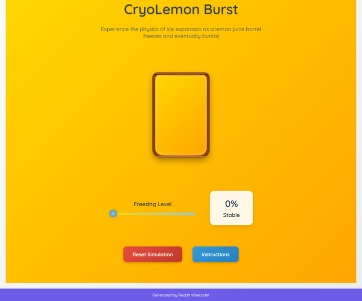

# Create a static web application (HTML/CSS/JS) where users can interactively 'freeze' a lemon juice barrel with a slider, visually observing it expand like a party balloon until it 'bursts' if over-frozen, with a reset option.

An interactive static web application that simulates the volumetric expansion and eventual bursting of a lemon juice barrel as it freezes, controlled by a user-operated slider. Experience the physics of ice expansion in a visually engaging way.

## Source Reddit Post
[View original post](https://reddit.com/r/mildlyinteresting/comments/1oixy98/my_lemon_juice_barrel_froze_solid_and_now_looks/)

## Features
- Interactive Freezing Slider: A highly responsive range input allows users to precisely control the 'freezing level' from 0% (liquid) to 100% (fully frozen).
- Visual Barrel Representation: A distinct, stylized barrel graphic (SVG or CSS-drawn) clearly displays the lemon juice, serving as the central interactive element.
- Dynamic Juice Transformation: The 'juice' inside the barrel progressively changes color (from vibrant yellow to icy blue/white) and develops a visible frost texture as it freezes.
- Volumetric Expansion & Strain: The barrel visually expands in width and height, and its surface displays subtle stress lines or cracks, simulating the physical strain from freezing liquid expansion.
- Burst Mechanic & Threshold: A carefully defined freezing level threshold (e.g., 90-95%) triggers a dramatic and irreversible 'burst' event.
- Dramatic Burst Visuals & Sound: An explosive animation featuring shattered barrel fragments, realistic splashing lemon-ice particles, and a loud, impactful 'explosion' sound effect upon rupture.
- Real-time Status & Feedback Display: A prominent text area shows the current 'Freezing Level' percentage and dynamic status messages (e.g., 'Stable', 'Expanding...', 'Critical!', 'BURSTED!').
- Simulation Reset Option: A clearly labeled 'Reset' button instantly restores the entire simulation, allowing users to experiment multiple times.
- Pre-Burst Warning Indicators: Visual cues, such as the barrel shaking, a pulsating red tint, and a 'Critical!' warning message, appear as the freezing level approaches the burst point.
- Ambient Freezing Audio Feedback: A subtle, growing 'cold' or 'ice' sound effect plays continuously, increasing in intensity and pitch as the freezing level rises.
- Interactive Instructions Overlay: A clean, concise modal overlay provides instructions on how to interact with the simulation, accessible via a dedicated button.
- Enhanced Accessibility & Control: The slider is fully keyboard navigable, and all interactive elements have clear focus states for a better user experience.

## Visual Polish
- Smooth CSS Transitions & Easing: All visual changes (barrel expansion, juice color shift, frost opacity, background color transformation) utilize smooth CSS transitions with advanced cubic-bezier easing functions for a highly fluid and natural aesthetic.
- Advanced Particle System for Burst: Integrates a customizable particle library (like tsparticles) to create a highly realistic and dynamic ice shard and lemon juice splash explosion effect that emanates from the barrel's rupture point.
- Dynamic Thematic Background: The application's background subtly, but noticeably, shifts from a warm, summery yellow to a crisp, icy blue, visually reinforcing the barrel's current temperature state.
- Barrel Material Strain & Frost Shader: As the barrel expands and freezes, a sophisticated CSS-based shader or pseudo-element effect creates visible strain lines and a shimmering, accumulating frost layer on its surface.
- Impactful Explosion Screen Shake: A subtle, short-duration 'screen shake' effect is applied to the main container upon the barrel's burst, adding a visceral and impactful punch to the event.
- Custom Themed Slider Aesthetics: The slider is custom-styled with a 'cold' theme, featuring a unique, icy-blue thumb that provides visual feedback (e.g., a subtle glow) on hover and drag.

## How to Run
- Open `index.html` in your browser

## Preview

