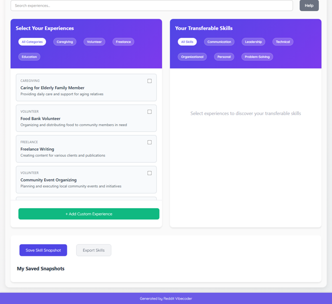

# A static web app allows users to select non-traditional life experiences like caregiving or short-term jobs and instantly view a list of associated transferable skills with example resume bullet points.

A static web app for discovering transferable skills from non-traditional life experiences, generating ready-to-use resume bullet points, and personalizing a skill portfolio.

## Source Reddit Post
[View original post](https://reddit.com/r/selfimprovement/comments/1oiqjiv/is_it_okay_to_not_work_when_you_are_27/)

## Features
- Interactive Experience Selection: Users select from a predefined, diverse list of non-traditional experiences (e.g., caregiving, volunteering, freelance projects).
- Dynamic Skill Display: Instantly shows a curated, de-duplicated list of transferable skills relevant to the currently selected experiences.
- Example Resume Bullet Points: Provides specific, actionable resume bullet points for each displayed skill, demonstrating real-world application.
- Multi-Experience Aggregation: Allows selection of multiple experiences to combine and intelligently de-duplicate skills for a holistic view.
- Skill Categorization & Filtering: Skills are grouped by type (e.g., Communication, Problem-Solving, Technical, Leadership) with interactive filters.
- Search Functionality: Enables quick keyword search across available experiences.
- My Skill Snapshot (localStorage): Users can save their current selection of experiences, skills, and bullets for later review and re-loading.
- Custom Experience Submission (localStorage): Users can input a new, unique experience and define associated skills/bullets, which are stored locally and become selectable.
- Export Functionality: Download currently displayed skills and bullet points as a plain text file or simple HTML document.
- Skill Definition Tooltips: Hovering over any displayed skill reveals a concise definition or explanation of that skill.
- Responsive UI: Adapts layout and component sizing for an optimal viewing experience across various desktop browser window sizes.
- Clear Onboarding & Help Section: Provides initial instructions, usage tips, and an FAQ accessible via a dedicated section.

## Visual Polish
- Animated Skill & Bullet Point Reveal: Smooth fade-in and subtle slide-up animations for new skills and bullet points as they appear in the display area.
- Interactive Hover States: Distinct visual feedback (e.g., subtle glow, slight scale, background color change) for clickable experience cards, skill tags, and action buttons.
- Themed Color Palette & Typography: A consistent, modern color scheme and professional font selection for a visually appealing and cohesive user interface.
- Visual Feedback for Actions: Confirmation toast messages (e.g., 'Saved to My Skill Snapshot!', 'Experience Added!') with a gentle bounce or fade animation upon successful user actions.
- Dynamic Layout Transitions: Graceful width/height transitions when sections expand, collapse, or when content areas are dynamically resized.

## How to Run
- Open `index.html` in your browser

## Preview

