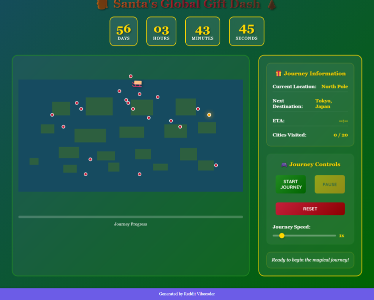

# A static HTML/CSS/JS web app that simulates Santa's Christmas Eve journey across a world map, sequentially highlighting predefined cities and displaying a real-time countdown to Christmas.

A static HTML/CSS/JS web application that visually simulates Santa's Christmas Eve journey across a world map, sequentially highlighting cities, showing his animated sleigh, and displaying a real-time countdown to Christmas.

## Source Reddit Post
[View original post](https://reddit.com/r/CasualConversation/comments/1ojih45/anyone_else_remember_santatracker/)

## Features
- Interactive World Map Visualization with predefined journey path.
- Animated Santa Sleigh icon moving smoothly between cities along the route.
- Real-time Christmas Countdown (Days, Hours, Minutes, Seconds) display.
- Dynamic City Highlighting for current and next destinations.
- Detailed Info Panel displaying current city name, next city name, and estimated arrival time.
- Visual Journey Progress Bar indicating overall completion.
- Full Playback Controls: Start, Pause, Resume, and Reset Journey.
- Adjustable Journey Speed Control via a slider.
- Automatic Map Panning/Zooming to keep Santa's current location in view.
- Persistent User Preferences (e.g., last selected journey speed) using localStorage.
- Festive visual and optional audio ambiance for an immersive experience.

## Visual Polish
- Smooth easing animations for Santa's sleigh movement between city points.
- Pulsating/Glowing CSS effects for the current and next highlighted cities.
- Subtle particle effects (e.g., 'sparkles' or 'snow dust') trailing Santa's sleigh.
- Elegant CSS transitions for UI panel expansions, button hover states, and information updates.
- A carefully chosen festive color palette (deep reds, forest greens, gold, sparkling whites) applied consistently throughout the UI.

## How to Run
- Open `index.html` in your browser

## Preview

